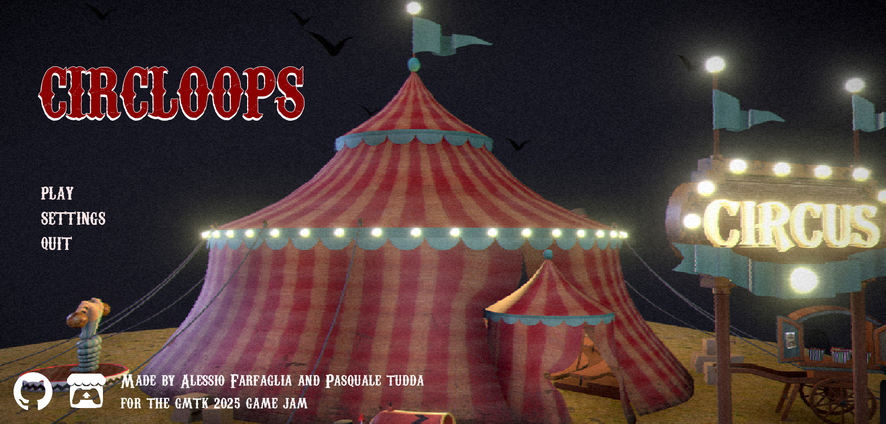
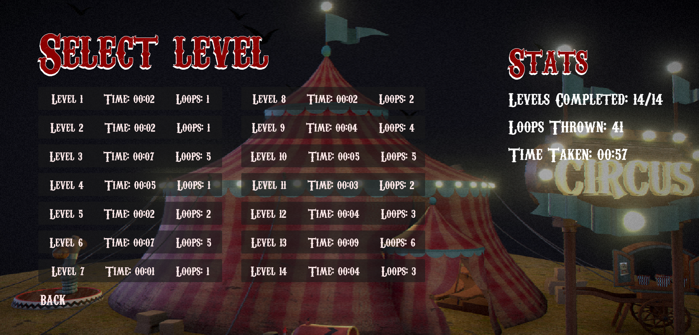
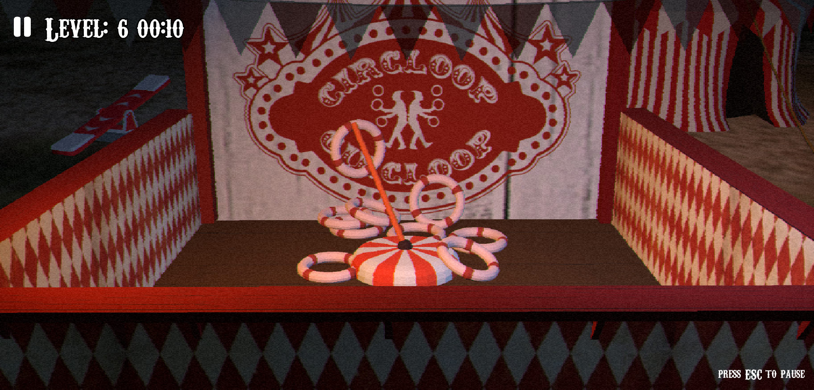
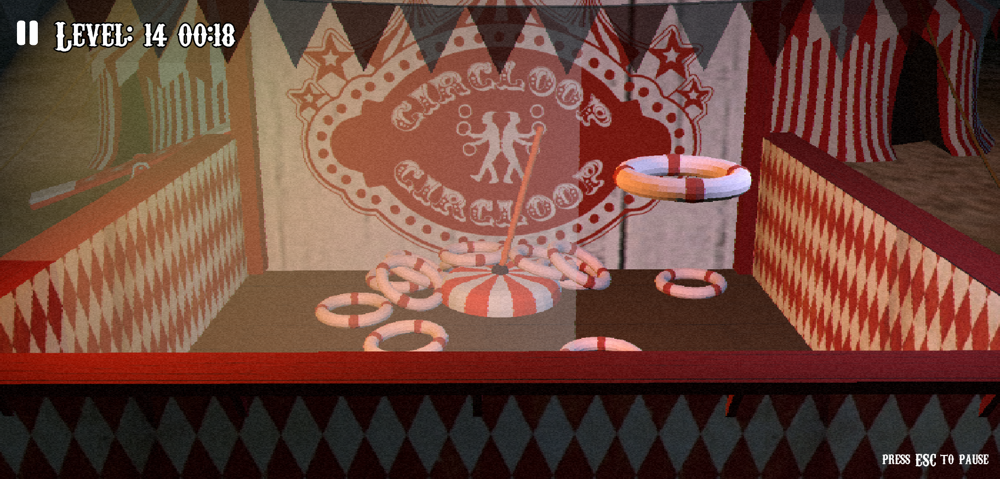
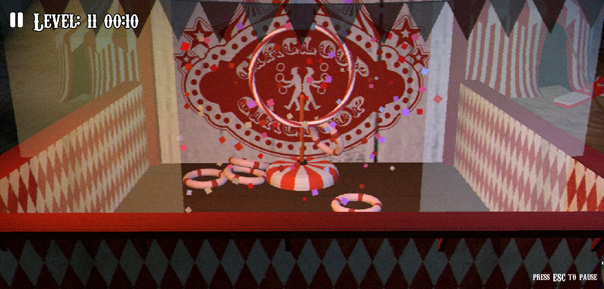

# Circloops

Circloops is a physics-based game where you throw rings to catch objects in a circus-themed environment. The game features multiple levels, each with unique challenges.

It was created using [Godot 4](https://godotengine.org/) for the [GTK 2025 Game Jam](https://itch.io/jam/gmtk-2025/entries) in under 4 days, the theme was "Loop".

You can play the game on [itch.io](https://farfi55.itch.io/circloops) or download it from [GitHub Releases](https://github.com/Farfi55/circloops/releases)

## How to play

Move and toss the loops by dragging and releasing, aim the trajectory, adjust toss and watch the loops fly toward the target

Levels have two types of target:
- poles
- hanging big loop

Beat the level by hitting all the targets to unlock the next one

## Screenshots

| |  |
|:---------------------------------------:|:----------------------------------:|
|  |  |

## Credits

- [Farfi55](https://github.com/Farfi55) - Game Design, Programming, Art
- [Ryuk4real](https://github.com/ryuk4real) - Programming, Shaders, UI/UX
- Michela Pata - Art

## Assets used

* [Circus music](https://pixabay.com/music/circus-circus-music-loop-362929/)
* [Circus Tent](https://skfb.ly/oQ7BJ), [Party Cannon](https://skfb.ly/oQ7AJ) and [See-Saw](https://skfb.ly/oQ7Cy) by BeaBea
* font [carnivalee freakshow](https://www.1001fonts.com/carnivalee-freakshow-font.html)
* [White Fabric Texture Stock photos by Vecteezy](https://www.vecteezy.com/free-photos/white-fabric-texture)

